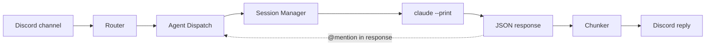
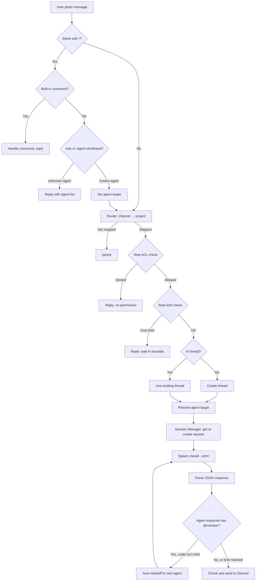
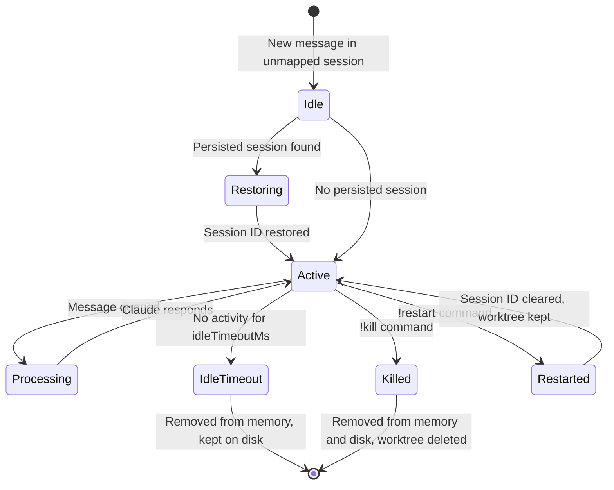

# Architecture

Multi-Project Gateway (MPG) is a Discord bot that routes channel messages to per-project [Claude Code](https://docs.anthropic.com/en/docs/claude-code) CLI sessions, managing session state, concurrency, and multi-agent dispatch automatically.

## System overview



**Key components:**

| Component | Module | Purpose |
|-----------|--------|---------|
| Router | `router.ts` | Maps Discord channel IDs to project configs |
| Agent Dispatch | `agent-dispatch.ts` | Parses `@mentions`, `!ask`, and `!agent` commands |
| Session Manager | `session-manager.ts` | Lifecycle, queue, concurrency, persistence |
| Claude CLI | `claude-cli.ts` | Spawns `claude --print`, parses JSON output |
| Worktree Manager | `worktree.ts` | Git worktree isolation per thread |
| Embed Formatter | `embed-format.ts` | Chunks responses, builds Discord embeds |
| Turn Counter | `turn-counter.ts` | Limits agent-to-agent handoff loops |
| Dashboard Server | `dashboard-server.ts` | HTTP dashboard and REST API |

## Module map

```
src/
├── cli.ts              CLI entry point: start, init, status, logs
├── index.ts            Re-exports for programmatic use
├── config.ts           Config loading, validation, defaults
├── discord.ts          Discord.js client, message handler, command parser, handoff loop
├── router.ts           Channel → project resolution
├── agent-dispatch.ts   Parse @mentions, !ask, !<agent> commands
├── session-manager.ts  Session lifecycle, queue, persist, resume
├── session-store.ts    JSON file-based session persistence
├── claude-cli.ts       Spawn claude subprocess, parse JSON, build CLI args
├── worktree.ts         Git worktree create/remove/reconcile
├── embed-format.ts     Discord embed rendering and message chunking
├── rate-limiter.ts     Per-user sliding-window rate limiting
├── role-check.ts       Discord role-based access control
├── persona-presets.ts  Built-in agent templates (pm, engineer, qa, designer, devops)
├── turn-counter.ts     Track and limit agent-to-agent handoff turns
├── dashboard-server.ts HTTP dashboard, REST API, and health endpoint
├── health.ts           Pre-flight health checks
├── logger.ts           Structured JSON logging
├── resolve-home.ts     Config/session path resolution (~/.mpg, profiles)
└── init.ts             Interactive setup wizard
```

## Message lifecycle

A message flows through these steps from Discord to Claude and back:



### Step-by-step

1. **Discord ingestion** — `discord.ts` receives `MessageCreate` event. Bot messages are ignored.
2. **Command check** — Messages starting with `!` are checked against built-in commands (`!sessions`, `!help`, `!agents`, `!kill`, `!restart`, `!session`). If matched, the reply is sent and processing stops.
3. **Agent command parse** — `!ask <agent> <message>` and `!<agent> <message>` are parsed via `agent-dispatch.ts`. Unknown agents get an error listing available agents.
4. **Channel resolution** — `router.ts` maps the channel ID (or parent channel for threads) to a project config. Unmapped channels are silently ignored.
5. **Access control** — If the project has `allowedRoles`, `role-check.ts` verifies the sender's Discord roles. If the project has `rateLimitPerUser`, `rate-limiter.ts` checks the sliding window.
6. **Thread management** — Main-channel messages spawn a new thread. Thread messages reply in-place.
7. **Agent resolution** — The target agent is determined by (in priority order): `!ask`/`!<agent>` command, `@agent` mention in text, or last active agent in the thread.
8. **Session lookup** — `session-manager.ts` looks up or creates a session keyed by `<threadId>` (no agent) or `<threadId>:<agentName>` (agent session). If a persisted session exists on disk, its session ID is restored for context resume.
9. **Worktree creation** — Thread sessions get an isolated git worktree at `.worktrees/<key>` with branch `mpg/<key>`.
10. **Claude invocation** — `claude-cli.ts` spawns `claude --print <prompt> [--resume <sessionId>] [--append-system-prompt <agentPrompt>]` with tool restriction flags. Thread history (last 20 messages) is prepended for agent sessions.
11. **Response parsing** — JSON output is parsed for `result`, `session_id`, and `is_error`. On failure, the session ID is cleared and one retry is attempted with a fresh session.
12. **Auto-handoff loop** — If the response text starts with `@<agent>`, `turn-counter.ts` checks the limit (default 5). If under the limit, the response is dispatched to the mentioned agent. The loop continues until no mention is found, the same agent is mentioned, or the turn limit is reached.
13. **Response delivery** — `embed-format.ts` chunks the response (2000 chars for plain text, 4096 for embeds) and sends it. Agent responses use colored embeds with the agent role as the author.
14. **Persistence** — The session ID and metadata are written to `sessions.json` after each invocation.

## Session management

### Session keys

Each session is identified by a key that determines its scope:

| Key format | Scope |
|------------|-------|
| `<threadId>` | User session — no agent, one per thread |
| `<threadId>:<agentName>` | Agent session — per agent per thread |

This allows multiple agents to maintain separate sessions and context within the same thread.

### Lifecycle



**Key behaviors:**

- **Concurrency control** — A global counter limits parallel Claude invocations to `maxConcurrentSessions` (default 4). Excess messages wait in a FIFO queue.
- **Idle timeout** — Sessions are removed from memory after `idleTimeoutMs` (default 30 minutes) of inactivity. The session ID and worktree persist on disk for later resume.
- **Session recovery** — On first error, the session manager retries with a fresh session ID (handles expired sessions). The `sessionReset` flag is set on the response so the user is notified.
- **Startup restore** — On boot, `session-store.ts` loads persisted sessions, prunes entries older than `sessionTtlMs` (default 7 days) or exceeding `maxPersistedSessions` (default 50), and restores the rest into memory.

### Persistence format

`sessions.json` stores an array of `PersistedSession` objects:

```typescript
interface PersistedSession {
  sessionId: string;
  projectKey: string;    // Thread ID or thread:agent
  cwd: string;           // Working directory (may be worktree path)
  lastActivity: number;  // Unix timestamp
  worktreePath?: string;
  projectDir?: string;   // Original project dir (if worktree used)
}
```

On save, in-memory sessions are merged with disk (in-memory takes precedence). Pruning runs on every save.

## Agent dispatch and handoff

### Dispatch methods

Users can target agents via three mechanisms (checked in this order):

1. **`!ask <agent> <message>`** — Explicit dispatch command
2. **`!<agent> <message>`** — Shorthand (only if not a built-in command)
3. **`@agent` mention in text** — Detected via regex over configured agent keys

If none match and the thread has a previously active agent, that agent is used (sticky routing).

### Auto-handoff loop

When an agent's response starts with `@<other-agent>`, the gateway automatically dispatches the response to that agent:

```
User → @pm "Add a login page"
  PM responds: "@engineer Please implement login with OAuth..."
    Engineer responds: "@qa Please verify the login flow..."
      QA responds: "Login works correctly. Found one edge case..."
        (no @mention → loop ends)
```

**Safeguards:**

- **Turn limit** — `maxTurnsPerAgent` (default 5) caps the loop. The counter resets on the next human message.
- **Self-mention** — If an agent mentions itself, the loop stops.
- **Error isolation** — If a handoff target fails, the error is posted to the thread and the loop stops. The previous agents' responses are preserved.

### Agent presets

Built-in personas are defined in `persona-presets.ts`:

| Preset | Role | Focus |
|--------|------|-------|
| `pm` | Product Manager | Requirements, task breakdown, handoff to engineers |
| `engineer` | Software Engineer | Implementation, testing, code quality |
| `qa` | QA Engineer | Testing, edge cases, verification |
| `designer` | Designer | UI/UX, accessibility, specifications |
| `devops` | DevOps Engineer | Infrastructure, CI/CD, reliability |

Projects can use presets directly (`"agents": ["pm", "engineer"]`) or extend them with additional prompt instructions.

## Configuration model

### Config resolution order

Configuration and environment files are resolved in priority order:

**Environment (`.env`):**
1. `$MPG_HOME/.env`
2. `$CWD/.env` (backward compatibility)

**Config (`config.json`):**
1. `--config <path>` (explicit CLI flag)
2. `--profile <name>` → `$MPG_HOME/profiles/<name>/config.json`
3. `$MPG_HOME/profiles/default/config.json`
4. `$CWD/config.json` (backward compatibility)

**Sessions:** Co-located with the resolved config file.

`$MPG_HOME` defaults to `~/.mpg`.

### Config structure

```typescript
interface GatewayConfig {
  defaults: {
    idleTimeoutMs: number;           // 1,800,000 (30 min)
    maxConcurrentSessions: number;   // 4
    sessionTtlMs: number;           // 604,800,000 (7 days)
    maxPersistedSessions: number;   // 50
    claudeArgs: string[];           // ["--permission-mode", "acceptEdits", "--output-format", "json"]
    allowedTools: string[];         // ["Read", "Edit", "Write", "Glob", "Grep", "Bash(git:*)", "TodoWrite"]
    disallowedTools: string[];      // []
    maxTurnsPerAgent: number;       // 5
    agentTimeoutMs: number;         // 180,000 (3 min)
    httpPort: number | false;       // 3100
    logLevel: LogLevel;             // "info"
  };
  projects: Record<string, ProjectConfig>;  // Keyed by Discord channel ID
}
```

### Config merging

Per-project settings override gateway defaults:

| Setting | Default | Project override |
|---------|---------|------------------|
| `idleTimeoutMs` | From `defaults` | `project.idleTimeoutMs` |
| `claudeArgs` | From `defaults` | Appended: `[...defaults, ...project]` |
| `allowedTools` | From `defaults` | Replaced entirely by `project.allowedTools` |
| `disallowedTools` | From `defaults` | Replaced entirely by `project.disallowedTools` |
| `agents` | None | Defined per-project only |

If `claudeArgs` already contains `--allowed-tools` or `--disallowed-tools`, the automatic tool args are skipped (manual override takes precedence). If both `allowedTools` and `disallowedTools` are set, `allowedTools` wins and a warning is logged.

## Security boundaries

### Permission model

Claude sessions are sandboxed via CLI flags:

| Mode | Flag | Capabilities |
|------|------|-------------|
| **Default** | `--permission-mode acceptEdits` | Read/edit files in project dir. Shell commands auto-denied in `--print` mode. |
| **Unrestricted** | `--dangerously-skip-permissions` | Full OS access. Must be explicitly set in `claudeArgs`. |

### Tool restrictions

The gateway builds `--allowed-tools` / `--disallowed-tools` flags from config:

**Default allowlist:**

| Tool | What it does |
|------|-------------|
| `Read` | Read file contents |
| `Edit` | Patch existing files |
| `Write` | Create or overwrite files |
| `Glob` | Find files by pattern |
| `Grep` | Search file contents |
| `Bash(git:*)` | Git commands only |
| `TodoWrite` | Manage task lists |

**Excluded by default:** unrestricted `Bash`, `WebSearch`, `WebFetch`, `NotebookEdit`.

### Discord access control

Two optional per-project mechanisms:

- **Role ACL** (`allowedRoles`) — List of Discord role names or IDs. If set, only members with a matching role can use the bot in that channel. Checked via `role-check.ts`.
- **Rate limiting** (`rateLimitPerUser`) — Maximum messages per minute per user. Uses a 1-minute sliding window in `rate-limiter.ts`. Returns retry-after seconds when exceeded.

### Trust boundary summary

```
Discord user
  ↓ (must have allowedRole, if configured)
  ↓ (must be under rate limit, if configured)
Gateway
  ↓ (routes to project directory only)
  ↓ (applies tool restrictions)
claude --print --permission-mode acceptEdits
  ↓ (can read/edit files in project dir)
  ↓ (shell commands auto-denied)
Project directory (or worktree)
```

Anyone who can post in a mapped Discord channel can instruct Claude to read and modify files in that project's directory. The gateway never silently escalates permissions — all security settings are visible in `config.json`.

## Extension points

### Adding agents

**Use a built-in preset:**
```json
{ "agents": ["pm", "engineer", "qa"] }
```

**Extend a preset with extra instructions:**
```json
{
  "agents": {
    "engineer": {
      "preset": "engineer",
      "prompt": "Always write tests before implementation."
    }
  }
}
```

**Define a fully custom agent:**
```json
{
  "agents": {
    "analyst": {
      "role": "Data Analyst",
      "prompt": "You analyze data and produce reports..."
    }
  }
}
```

### Per-project customization

Each project entry supports:

| Field | Purpose |
|-------|---------|
| `claudeArgs` | Additional CLI flags (e.g., model selection, custom permissions) |
| `allowedTools` / `disallowedTools` | Override default tool restrictions |
| `agents` | Project-specific agent roster |
| `allowedRoles` | Discord role ACL |
| `rateLimitPerUser` | Message throttling |
| `idleTimeoutMs` | Custom session idle timeout |

### Git worktrees

Each thread session gets an isolated git worktree:

- **Directory:** `.worktrees/<sanitized-key>` within the project
- **Branch:** `mpg/<sanitized-key>`
- **Lifecycle:** Created on first message, persists across idle timeouts, cleaned up on `!kill` or startup reconciliation

This prevents concurrent threads from conflicting in the main checkout. Worktrees are reconciled on startup — any worktree not associated with a known session is removed.

### Health and observability

The HTTP server (default port 3100) exposes:

| Endpoint | Data |
|----------|------|
| `GET /` | Auto-refreshing HTML dashboard |
| `GET /health` | Bot status, uptime, session/queue counts |
| `GET /api/sessions` | Active sessions with details |
| `GET /api/projects` | Configured projects and agents |
| `GET /api/status` | Combined status (version, health, sessions, projects) |

Structured JSON logs are written to stdout and can be filtered with `mpg logs --project <name> --level <level>`.
